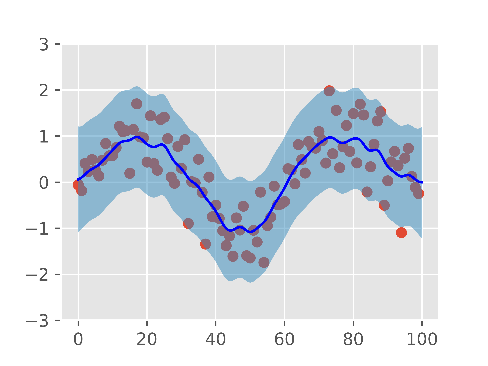

# Learning Machine Learning

Welcome!  This repository is built for anyone interested in learning more about 
different facets of **machine learning**, a subfield of artificial intelligence.  
Whether you want to learn more about native Python, C++, or the advanced tutorials 
or algorithms driving state-of-the-art in machine learning and artificial intelligence today, 
my goal is for this repository to be a resource for your learning in these fields.

I'm also working on an open-source guide for machine learning and AI.  You can 
find it [here](https://docs.google.com/document/d/1XS8DIW_nVHKe8Gfp6hK24GMVcaM4TKbZCMEVxJfdG7Y/edit?usp=sharing) as a set of google docs, as well as [here](https://rmsander.github.io/documentation/index.html) as part of my personal website.  Both of 
these are continuously evolving and will have more content added to them in time.

## Installation
For full use of all Jupyter notebooks and libraries, please install requirements 
using either `conda` or `pip`:

- `conda`: `conda env create -f requirements.txt -n learning_ml python=3.7`
- `pip`: `pip install -r requirements.txt`

## Concepts
For learning about concepts in machine learning, computer vision, operating systems, and programming, please visit the `concepts/` directory to view the different pdf files for these concepts.  Concepts currently covered include:

1. Computer Vision and Deep Learning
2. Introductory Slides on Python

## Python Programming

### Overview
Python is a powerful, high-level, interpreted programming language widely used for 
machine learning, probability, statistics, and scientific computing.  Many state-of-the-art frameworks for 
machine learning, such as **TensorFlow**, **PyTorch**, **NumPy**, **Scikit-Learn**, and **Keras** all have open-source implementations in Python.  You can find exercises for Python under the `python` directory.  See contents below:

### Intro To Python
* Under `python/intro_to_python`, you can find Python files covering fundamentals in Python, such as:
1. Python data structures (lists, tuples, dictionaries, strings, ints/floats)
2. Loops and iteration (for and while)
3. Conditional logic
4. Functions
5. I/O (input/output)
6. A brief intro to `numpy`

You can also find some introductory concepts in a more "notebook"-like fashion under `python/introductory_notebooks`.

### Intro to Machine Learning Fundamentals, Applications, and Domains
Want to start learning machine learning ab initio-style, from first principles?  Or
looking for examples of different applications and domains for this field?  If so, I invite 
you to check out `python/machine_learning_in_python/`.  In this directory, I have
tutorials for:

1. [Clustering Algorithms, such as K-Means Clustering](https://github.com/rmsander/learning-machine_learning/tree/master/python/machine_learning_in_python/clustering)
2. [Dimensionality Reduction, i.e. Principal Component Analysis (PCA)](https://github.com/rmsander/learning-machine_learning/tree/master/python/machine_learning_in_python/dimensionality_reduction)
3. [Adversarial Search Algorithms](https://github.com/rmsander/learning-machine_learning/tree/master/python/machine_learning_in_python/adversarial_search)
4. [Computer Vision](https://github.com/rmsander/learning-machine_learning/tree/master/python/machine_learning_in_python/computer_vision)
5. [Game Theory](https://github.com/rmsander/learning-machine_learning/tree/master/python/machine_learning_in_python/game_theory)
6. [Gaussian Process Regression (GPR)](https://github.com/rmsander/learning-machine_learning/tree/master/python/machine_learning_in_python/gaussian_process_regression)
7. [General Optimization](https://github.com/rmsander/learning-machine_learning/tree/master/python/machine_learning_in_python/optimization)
8. [Reinforcement Learning (RL)](https://github.com/rmsander/learning-machine_learning/tree/master/python/machine_learning_in_python/reinforcement_learning)
9. [Sampling](https://github.com/rmsander/learning-machine_learning/tree/master/python/machine_learning_in_python/sampling)
10. [Robotics](https://github.com/rmsander/learning-machine_learning/tree/master/python/machine_learning_in_python/robotics)

### Learning Python Packages For Machine Learning
The Python programming language contains numerous packages with functions and modules
implemented to get your machine learning projects and pipelines off the ground quickly,
reliably, and in a scalable way.  You can find tutorials, in the form of `.ipynb` Jupyter
notebooks, for the following Python packages under `python/python_package_tutorials/`:
1. [`numpy` (NumPy)](https://github.com/rmsander/learning-machine_learning/tree/master/python/python_package_tutorials/numpy)
2. [`cv2` (OpenCV)](https://github.com/rmsander/learning-machine_learning/tree/master/python/python_package_tutorials/opencv)
3. [`tensorflow` (TensorFlow) and `keras` (Keras)](https://github.com/rmsander/learning-machine_learning/tree/master/python/python_package_tutorials/tensorflow)
4. [`pytorch` (PyTorch)](https://github.com/rmsander/learning-machine_learning/tree/master/python/python_package_tutorials/pytorch)
5. [`pandas` (Pandas)](https://github.com/rmsander/learning-machine_learning/tree/master/python/python_package_tutorials/Pandas%20Exercises)
6. [`gpytorch` (GPyTorch)](https://github.com/rmsander/learning-machine_learning/tree/master/python/python_package_tutorials/gpytorch)
7. [`aws` (EC2 + Boto3 APIs)](https://github.com/rmsander/learning-machine_learning/tree/master/python/python_package_tutorials/aws)

## C++ Programming
Exercises and examples for programming in C++ can be found in `./c++/`.  These examples are mainly derived from exercises with programming drones for autonomous racing in MIT's 16.485: Visual Navigation for Autonomous Vehicles course.  Some examples of code include:

1. Creating a `RandomVector` class that samples a random vector of arbitrary dimension from a uniform distribution.
2. `roscpp` exercises.

## Stata Programming
Stata, a statistical programming language, is also useful for data science, machine learning, and econometrics.  You can find content and examples for stata in   `./stata/`.

## Missing Something?  More Concepts You Would Like to See?
If you have questions or would like content to be added for a specific topic, 
please feel free to let me know via [this google form](https://forms.gle/yH4NxYYQsqjNexuQ8).  I'm always looking for ways to improve this website and my documentation.
If you're interested in learning more about machine learning through online articles, 
please check out my Medium blog [here](https://rmsander.medium.com).
