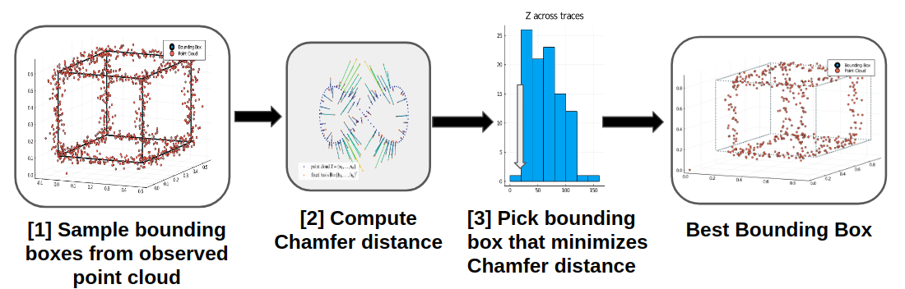

# Point Cloud Bounding Box Inference
A probabilistic programming-based implementation for an unsupervised object detection framework using generative models and importance sampling.

## Overview
This framework serves as a proof of concept for unsupervised 3D bounding box object detection using Gen, a novel probabilistic programming language built on top of Julia.  Below is a block diagram of our system:

For more information on this framework, please see my project report [here](report.pdf).

## Installation
Please ensure that Julia 1.0 or higher is installed.  See installation instructions [here](https://julialang.org/downloads/).  After installing Julia, check to make sure your shell recognizes the command `julia`.  Once this is done, you'll need to install the following Julia packages:

```
# Start a Julia REPL
julia

# Use Pkg
using Pkg

# Add packages
Pkg.add("PyPlot")
Pkg.add("Random")
Pkg.add("Plots")
Pkg.add("Plotly")
Pkg.add("PyCall")
Pkg.add("LinearAlgebra")
```
Next, you'll need to install `Gen`.  In a Julia REPL:
1. Type `]` to enter "package mode".
2. Run: `add https://github.com/probcomp/Gen`.

## Usage
This framework is designed to perform Bayesian inference on both synthetic and real **point cloud** data.  The Jupyter notebook (`generative_pc_models.jl.ipynb`) provides a complete walk-through of the data generation/curation processes for 
real and synthetically-generated point cloud data, and the files listed below each constitute components of this pipeline:

1. `create_synthetic_data.jl`: Creates synthetic point cloud data.
2. `load_a2d2.jl`: Julia functions for loading/configuring lidar point cloud and 3D bounding box data from the Audi Autonomous Driving Dataset (A2D2).
3. `plotting_distance_utils.jl`: Julia functions for plotting point clouds, bounding boxes, and distance utilities (Chamfer distance) for scoring/evaluating our proposed bounding boxes given an observed point cloud.
4. `generative_models.jl`: Gen functions for constructing generative models for our bounding boxes, which we use as part of our pipeline to create proposed bounding boxes that fit our observed data well.
5. `inference_evalaution.jl`: Gen and Julia functions for running inference using importance sampling with a custom proposal distribution, and for evaluating the performance of our unsupervised approach on synthetic and real point clouds.

These frameworks are all highly flexible, and were deliberately implemented in a modular manner such that they can be integrated/modified in different ways without affecting the rest of the pipeline.  If you have any questions about this pipeline, please feel free to reach out to me at [rmsander1026@gmail.com](mailto:rmsander1026@gmail.com).
